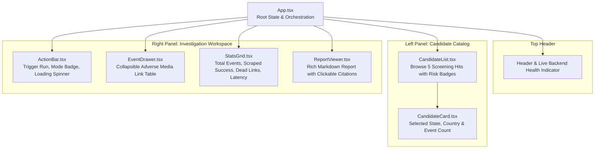

# Frontend Architecture & Implementation Documentation

This document outlines the architecture, component structure, state management, and API integration for the **Compliance Investigator Workspace**.

---

## 1. System & Component Hierarchy



---

## 2. TypeScript Data Contracts (Mirrors Backend Pydantic Schemas)

```typescript
// Single Event Link from Screening Hit
export interface EventLink {
  url: string;
  title?: string;
  source_name?: string;
}

// Candidate Screening Profile (from GET /api/v1/candidates)
export interface CandidateProfile {
  candidate_id: string;
  hit_id: string;
  entity_name: string;
  risk_category: string;
  country: string;
  description: string;
  total_events: number;
  events: EventLink[];
}

// Request Payload sent to POST /api/v1/summarize
export interface CandidateHitRequest {
  candidate_id: string;
  hit_id: string;
  entity_name: string;
  events: EventLink[];
}

// Scraping Execution Statistics
export interface ScrapingStats {
  total_links: number;
  successful_scrapes: number;
  failed_scrapes: number;
}

// Final Investigator Response from Agent
export interface SummaryResponse {
  candidate_id: string;
  hit_id: string;
  entity_name: string;
  stats: ScrapingStats;
  summary_report: string;
  created_at: string;
}
```

---

## 3. Dynamic Mode Detection

The UI dynamically inspects the link count of the selected candidate and displays an intelligent mode indicator:

* **Direct Mode (`<= 3` links):** Displays green badge `⚡ Direct Mode (Single Gemini 2.5 Pro Prompt)`.
* **Map-Reduce Mode (`> 3` links):** Displays blue badge `🔄 Map-Reduce Mode (Parallel Gemini 2.5 Flash + Pro Synthesis)`.

---

## 4. API Endpoints Used

* `GET /health`: Used on mount to verify backend connectivity (displays green online ping in the navbar).
* `GET /api/v1/candidates`: Loads the pre-generated candidate directory.
* `POST /api/v1/summarize`: Sends the selected candidate hit to the agent for live scraping and Map-Reduce synthesis.

